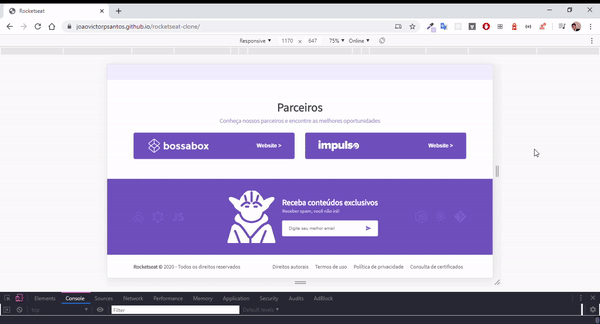

<h2 align="center">


# HomePage Rocket

> Clone da homepage do site da Rocketseat feito com HTML e CSS, para ver o resultado <a href="https://joaovictorpsantos.github.io/rocketseat-clone/">clique aqui</a>, e para ver a séria de vídeos desenvolvendo <a href="https://www.youtube.com/playlist?list=PLLSLbEdBpdAu126QAOzpr8QSuoAP90JFe">clique aqui</a>.

<a href="https://github.com/joaovictorpsantos">

</a>

<a href="#">

</a>

<a href="https://github.com/joaovictorpsantos/rocketseat-clone/stargazers">

</a>

<a href="https://github.com/joaovictorpsantos/rocketseat-clone/network/members">

</a>


<a href="https://github.com/joaovictorpsantos/rocketseat-clone/commits/master">

</a>

<br/><br/>

<div style="display:flex">


</div>
<div style="display:flex">


</div>
</h2>

<blockquote align="center">
  Esse projeto é open-source, contribua você também :D
</blockquote>

<hr/>

## 💡 Sobre o projeto:

Para poder estudar e treinar mais minhas habilidades com HTML e CSS sem framework, resolvi refazer a home do site da <a href="">Rocketseat</a> para poder treinar e fixar o que estou estudando e compartilhar o processo de desenvolvimento em uma série de vídeos no youtube, caso queira ver, <a href="https://www.youtube.com/playlist?list=PLLSLbEdBpdAu126QAOzpr8QSuoAP90JFe">clique aqui</a>, e o projeto em produção está disponível <a href="https://joaovictorpsantos.github.io/rocketseat-clone/">aqui</a>.

## 🔥 O que aprendemos?

Através dessa aplicação conseguimos entender:

- Táticas para criar um site responsivo
- Como poder usar o display flexbox
- Entender como funcionas os @medias no CSS
- Enteder o uso do @import no CSS

## ⚙️ Techs:

- HTML
- CSS

## ⛏ Ferramentas:

- [Visual Studo Code](https://code.visualstudio.com/download)

## 🏁 Executar esse projeto:

Para executar esse projeto em sua máquina,  
De o clone no repositório:

```bash
$ git clone https://github.com/joaovictorpsantos/rocketseat-clone.git
```

Abra a página "index.html" no browser.

<br/>

<h4 align="center">
  Vamos compartilhar conhecimento e crescer juntos!!!
</h4>

<br/>

---

<h3 align="center">
Autor: <a alt="João Victor Pereira Santos" href="https://github.com/joaovictorpsantos">João Victor Pereira Santos</a>
</h3>

<p align="center">

  <a alt="João Victor Pereira Santos Linkedin" href="https://www.linkedin.com/in/joao-victor-pereira-santos//">
    </a>
  <a alt="João Victor Pereira Santos GitHub" href="https://github.com/joaovictorpsantos">
  </a>
 <a alt="João Victor Pereira Santos Twitter" href="https://twitter.com/_joaovictorps">
  </a>

</p>
